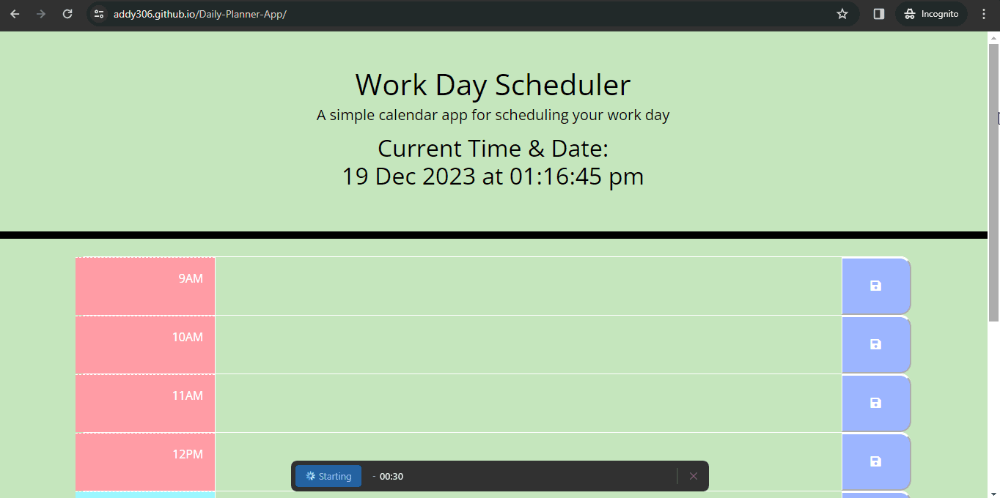

# Daily-Planner-App

<!-- PROJECT LOGO -->
 

  

  

    A simple calendar application that allows a user to save events for each hour of the day.
     
    <a href="https://github.com/addy306/Daily-Planner-App"><strong>GitHub repository</strong></a>
     
    <a href="https://addy306.github.io/Daily-Planner-App/"><strong>Deployed Website</strong></a>
     
     
    
  

<!-- ABOUT THE PROJECT -->
## About The Project
This browser app is built for an employee with a busy schedule. It enables them to add important events to a daily planner, in order to manage their time effectively
.See Demo below 

## Webpage Features

### The following animation demonstrates the application functionality:

### images

#### image 1

#### image 2

* pastel pink : represents the past events
* pastel blue : represents the present events
* pastel blue : represents the future events

Allows user to safe their schedule

### Built With

* Bootstrap
* HTML
* CSS
* Javascript
* JQuery
* Day.js

<!-- LICENSE -->
## License

Distributed under the MIT License. See `LICENSE.txt` for more information.

Project Link: [https://github.com/addy306/Daily-Planner-App](https://github.com/addy306/Daily-Planner-App)

## Helpful Resources

- [Bootstrap Documentation](https://getbootstrap.com/docs/5.3/getting-started/introduction/)

- [Jquery API Documentation](https://api.jquery.com/)

- [Day.js Documentation](https://day.js.org/)

- [Github Pages Guide](https://pages.github.com/)

